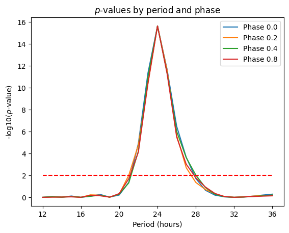

# Analytic Cosiner Test

A novel computational method for detecting circadian rhythmicity in time-series data with minimal computational cost and analytical derivation of statistical significance.

## Overview

The analytic cosiner test is designed to detect rhythmic patterns in biological time-series data, particularly for circadian rhythm analysis. This method provides both oscillation phase estimation and statistical significance testing through analytical p-value derivation, avoiding computationally expensive permutation-based approaches.

## Background

For statistical testing of circadian rhythmicity, we focus specifically on oscillation components at a 24-hour period. This approach is based on experimental designs that sample data every 4 hours over two days, concatenating two 48-hour time series into one virtual 96-hour dataset to identify reliable oscillation patterns that repeatedly appear in the time series.

Since the time series length is 96 hours, various periodic oscillations are possible (48, 32, 24, 19.2, 16, ... hours), corresponding to two, three, four, five, and six full-wave repeats. Among these periodic oscillations, we focus on the 24-hour period as we are interested in circadian neural activity. This constraint to 24-hour oscillations also makes the interpretation of oscillation phases straightforward.

## Methodology

### Core Principle

The method analyzes rhythmicity in data (such as c-Fos–positive cell counts in brain regions or voxels) using analytical cosinor analysis. A linear combination of sine and cosine functions at a given oscillation period can represent a sinusoidal waveform with arbitrary oscillation phase. The weights of this linear combination are obtained by projecting the waveform onto the sine and cosine functions.

Key properties:
- The ratio of the two weights represents the oscillation phase
- The norm of the weights represents similarity between the waveform and sinusoidal curves
- These properties form the foundational concepts of Fourier transformation

Importantly, the norm of the weights is equivalent to Pearson's correlation when all vectors (sine, cosine, and waveform) are normalized to have means of 0 and lengths of 1.

### Mathematical Formulation

The maximum Pearson correlation (𝐿) between the time series data and the sinusoidal waveform with the closest oscillation phase is calculated as:

**Eq.1**

$$
L = \sqrt{(\vec{X} \cdot \vec{B_s})^2 + (\vec{X} \cdot \vec{B_c})^2}
$$

where $\vec{X}$, $\vec{B_s}$, and $\vec{B_c}$ are vectors representing the time-series data, sine basis, and cosine basis, respectively. Each vector is normalized to have zero mean and unit length.

The oscillation phase of X is given by:

**Eq.2**

$$
\phi = \arctan\left(\vec{X} \cdot \vec{B_s} , \vec{X} \cdot \vec{B_c}\right)
$$

### Statistical Significance

To evaluate the statistical significance of obtaining a certain Pearson correlation ($L$), we consider a random distribution of waveforms. Since the number of elements ($n$) in a vector equals the number of data points in the time series, a random waveform vector has 24 independent and identically distributed random variables, assumed to follow a Gaussian distribution.

After normalizing each vector to have zero mean and unit length, the random vectors are uniformly distributed on the surface of a unit sphere of radius 1 in $(n-1)$ dimensional space. One dimension is reduced because the normalization removes one degree of freedom.

### Geometric Interpretation

The sine and cosine curves ($\vec{𝐵𝑠}$ and $\vec{𝐵𝑐}$) are also vectors on this $(n-1)$ dimensional unit sphere. These vectors span a plane in the $(n-1)$ dimensional space, where:
- The length of the projected vector onto the plane represents the Pearson correlation to the closest sinusoidal wave among all oscillation phases
- The direction of the projected vector represents the oscillation phase of the closest sinusoidal wave

Waveform vectors with a certain correlation ($L$) are those projected onto the circumference of a circle with radius $L$ on the plane from the sphere. These vectors are distributed on the intersection between the sphere and a cylinder extending perpendicularly from the circle with radius $L$ on the plane.

The intersection points can be generally represented by the equation:

**Eq.3**

$$
\begin{align*} 
 x_1^2 + x_2^2+x_3^2 +\dots+x_{n-1}^2 &= 1 \\
 x_1^2 + x_2^2 &= L^2 \\
 \Longrightarrow \\
 x_3^2+\dots+x_{n-1}^2 &= 1-L^2
\end{align*}
$$

This equation shows that the intersection in $(n-1)$ dimensional space is equivalent to the surface of a sphere with radius $\sqrt{1-L²}$ in $(n-3)$ dimensional space.

### Probability Derivation

Vectors with correlation $r > L$ on the surface of the $(n-1)$ dimensional sphere are distributed inside this $(n-3)$ dimensional sphere, represented by:

**Eq.4**

$$
 x_3^2+\dots+x_{n-1}^2 < 1-r^2 \quad (r>L)
$$

Therefore, the probability of obtaining Pearson correlations higher than $L$ from random waveforms is given by the volume ratio:

**Eq.5**

$$
P(r>L) = \frac{V_{n-3}(\sqrt{1-L^2})}{V_{n-3}(1)}
$$

Since the volume of an n-dimensional sphere is [[1]](#references):

**Eq.6**

$$
V_n(r) = \frac{\pi^{n/2}}{\Gamma(2n+1)}r^n
$$

Equation 5 leads to:

**Eq.7**

$$
P(r>L)=\left(1-L^2\right)^{\frac{n}{2}}
$$


This is the cumulative distribution function (CDF) for the probability of obtaining a Pearson correlation (L) or higher from random waveforms. 

The probability density function (PDF), is hence, the derivative of Eq7:

**Eq.8**

$$
p(L) = nL\left(1-L^2\right)^{\frac{n}{2}-1}
$$

## Error Handling

Measurement errors at each time point can be incorporated by reducing the length of the projected vector according to error magnitude. Error size is modeled as an ellipsoid with radii of $1.96 × SEM$ on each axis at the tip of the waveform vector in $(n-1)$ dimensional space. The factor 1.96 establishes the radius of the 95% confidence interval. The length ratio of the waveform vector reaching the ellipsoid surface is used to conservatively shrink the projected vector length according to error size.

## Method Sensitivity

While this study focuses on 24-hour period oscillations, the cosiner method has broad sensitivity around 24-hour periods. Pure sinusoidal curves ranging from 21- to 27-hour periods result in *p*-values under 0.01 (**Figure**), demonstrating practical coverage around circadian oscillations.



**Figure**: The analytic cosiner method detects pure sinusoidal oscillations with periods ranging from 21 to 27 hours with high sensitivity (*p* < 0.01), demonstrating robust performance around the circadian range.*

## Implementation

A reference implementation of the analytic cosiner method written in Python is available in this repository.

### Usage

```python
import numpy as np
from costest import costest, batch_costest

# Single time-series analysis
time_series = np.array([...])  # Your time-series data
n_timepoints_per_period = 6   # For 24-hour periods with 4-hour interval sampling

correlation, phase, p_value, sem_adj_p_value = costest(
    time_series, 
    n_timepoints_per_period
)

# Batch analysis for multiple time-series
data_matrix = np.array([[...], [...], ...])  # Multiple time-series
results = batch_costest(data_matrix, n_timepoints_per_period)
```

## Applications

This method is particularly useful for:
- Circadian rhythm analysis in biological data
- Large-scale analysis of rhythmic patterns (millions of timeseries)
- Any time-series analysis requiring efficient rhythmicity detection
- Studies where computational efficiency is critical

## Note

The null distribution in this method assumes that individual time points are independent. This assumption may be violated if the sampling interval is too short for the biological process of interest, where measured values are likely to be correlated with previous measurements (temporal autocorrelation). In the context of circadian biology involving protein or gene expression, a four-hour sampling interval has been empirically shown to be sufficient for the independence assumption to hold.

## References

<a id="references"></a>

[1] Equation 5.19.4, NIST Digital Library of Mathematical Functions. http://dlmf.nist.gov/5.19#E4, Release 1.0.6 of 2013-05-06.
