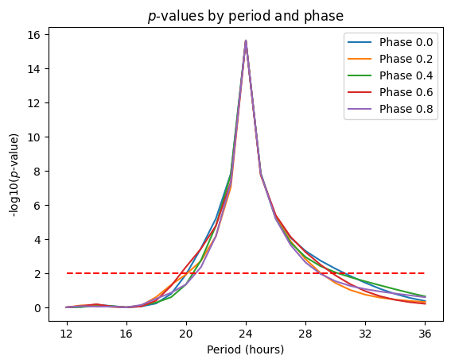

# Analytic Cosinor Test

A computational method for detecting circadian periodicity in time-series data with minimal computational cost and analytical derivation of statistical significance.

## Overview

The analytic cosinor test is designed to detect rhythmic patterns in biological time-series data sampled at an equal interval, particularly for circadian rhythm analysis. This method provides both oscillation phase estimation and statistical significance testing through analytical *p*-value derivation.

## Background
The challenge of analyzing modern datasets, which can contain hundreds of millions of time series, demands exceptionally efficient tools for rhythm detection [[Yamashita et al.]](https://royalsocietypublishing.org/doi/10.1098/rspa.1929.0151). To meet this need, we developed the analytic cosinor test, a method optimized for high-throughput analysis. Instead of relying on computationally intensive data-shuffling simulations (permutations), our test uses a direct analytical formula to rapidly calculate a rhythm's statistical significance (*p*-value) and phase.

The key point is its focused approach. Unlike exploratory methods such as Fisher's G-test, which search for any potential rhythm across a wide range of frequencies, the analytic cosinor test is designed to efficiently test for a single, pre-specified period (e.g., a 24-hour circadian rhythm). Interestingly, while its application is more targeted, our method is built upon the same foundational geometric principles that Fisher originally used to derive his null distribution  [[Fisher R.A.]](https://royalsocietypublishing.org/doi/10.1098/rspa.1929.0151). This targeted design yields several advantages: 1) A simpler mathematical formulation, 2) A boost in computational speed, and 3) An intuitive handling for incorporating measurement errors for each individual data point.

For statistical testing of circadian periodicity in our study, we focus specifically on the oscillation component at a 24-hour period. This is because of our experimental design, in which we sample data every 4 hours over days, resulting in, for example, a 96-hour dataset [[Yamashita et al.]](#references). A time series with a length of 96 hours can contain a set of periodic oscillations (48, 32, 24, 19.2, 16, ... hours of periods), corresponding to two, three, four, five, and six full-wave repeats in the time series. While the analytic cosinor method is applicable to any harmonic periods among these periodic oscillations, we focus on the 24-hour period as we are interested in circadian neural activity. It is also notable that this constraint to 24-hour oscillations makes the interpretation of oscillation phases among time series straightforward. 

## Methodology

### Core Principle

The method analyzes rhythmicity in data (such as c-Fos–positive cell counts in brain regions or voxels) using analytical cosinor analysis. A linear combination of sine and cosine functions at a given oscillation period can represent a sinusoidal waveform with an arbitrary oscillation phase. The weights of this linear combination are obtained by projecting the waveform onto the sine and cosine functions.

Key properties:
- The ratio of the two weights represents the oscillation phase
- The norm of the weights represents similarity between the waveform and sinusoidal curves
- These properties form the foundational concepts of the Fourier transformation

Importantly, the norm of the weights is equivalent to Pearson's correlation when all vectors (sine, cosine, and waveform) are normalized to have means of 0 and lengths of 1.

### Mathematical Formulation

The maximum Pearson correlation (𝐿) between the time series data and the sinusoidal waveform with the closest oscillation phase is calculated as:

**Eq.1**

$$
L = \sqrt{(\vec{X} \cdot \vec{B_s})^2 + (\vec{X} \cdot \vec{B_c})^2}
$$

where $\vec{X}$, $\vec{B_s}$, and $\vec{B_c}$ are vectors representing the time-series data, sine basis, and cosine basis, respectively; each vector is normalized to have zero mean and unit length.

The oscillation phase of X is given by:

**Eq.2**

$$
\phi = \arctan\left(\vec{X} \cdot \vec{B_s} , \vec{X} \cdot \vec{B_c}\right)
$$

### Statistical Significance

To evaluate the statistical significance of obtaining a certain Pearson correlation ($L$), we consider a random distribution of waveforms. Since the number of elements ($n$) in a vector equals the number of data points in the time series, a random waveform vector has 24 independent and identically distributed random variables, assumed to follow a Gaussian distribution.

After normalizing each vector to have zero mean and unit length, the random vectors are uniformly distributed on the surface of a unit sphere of radius 1 in $(n-1)$ dimensional space. One dimension is reduced because the normalization removes one degree of freedom.

### Geometric Interpretation

The sine and cosine curves ($\vec{𝐵𝑠}$ and $\vec{𝐵𝑐}$) are also vectors on this $(n-1)$ dimensional unit sphere. These vectors span a plane in the $(n-1)$ dimensional space, where:
- The length of the projected vector onto the plane represents the Pearson correlation to the closest sinusoidal wave among all oscillation phases
- The direction of the projected vector represents the oscillation phase of the closest sinusoidal wave

Waveform vectors with a certain correlation ($L$) are those projected onto the circumference of a circle with radius $L$ on the plane from the sphere. These vectors are distributed on the intersection between the sphere and a cylinder extending perpendicularly from the circle with radius $L$ on the plane.

The intersection points can be generally represented by the equation:

**Eq.3**

$$
\begin{align*} 
 x_1^2 + x_2^2+x_3^2 +\dots+x_{n-1}^2 &= 1 \\
 x_1^2 + x_2^2 &= L^2 \\
 \Longrightarrow \\
 x_3^2+\dots+x_{n-1}^2 &= 1-L^2
\end{align*}
$$

This equation shows that the intersection in $(n-1)$ dimensional space is equivalent to the surface of a sphere with radius $\sqrt{1-L²}$ in $(n-3)$ dimensional space.

### Probability Derivation

Vectors with correlation $r > L$ on the surface of the $(n-1)$ dimensional sphere are distributed inside this $(n-3)$ dimensional sphere, represented by:

**Eq.4**

$$
 x_3^2+\dots+x_{n-1}^2 < 1-r^2 \quad (r>L)
$$

Therefore, the probability of obtaining Pearson correlations higher than $L$ from random waveforms is given by the volume ratio:

**Eq.5**

$$
P(r>L) = \frac{V_{n-3}(\sqrt{1-L^2})}{V_{n-3}(1)}
$$

Since the volume of an n-dimensional sphere [[NIST Digital Library of Mathematical Functions]](http://dlmf.nist.gov/5.19#E4) is:

**Eq.6**

$$
V_n(r) = \frac{\pi^{n/2}}{\Gamma(n/2+1)}r^n
$$

Equation 5 leads to:

**Eq.7**

$$
P(r>L)=\left(1-L^2\right)^{\frac{n-3}{2}}
$$


This gives the probability of obtaining a Pearson correlation (*L*) or higher from random waveforms. 

The probability density function (PDF) is hence given by taking the derivative of $1-P(r>L)$:

**Eq.8**

$$
p(L) = (n-3)L\left(1-L^2\right)^{\frac{n-5}{2}}
$$

## Error Handling

Measurement errors at each time point can be incorporated by reducing the length of the projected vector according to error magnitude. Error size is modeled as an ellipsoid with radii of `ci_factor` × SEM on each axis at the tip of the waveform vector in $(n-1)$ dimensional space. The `ci_factor`=0.0375, which is the default value, establishes the radius of the ~3% confidence interval. The length ratio of the waveform vector reaching the ellipsoid surface is used to conservatively shrink the projected vector length according to the error size.

## Method Sensitivity

While this study focuses on 24-hour period oscillations, the cosinor method has broad sensitivity around 24-hour periods. Pure sinusoidal curves ranging from 21- to 27-hour periods result in *p*-values under 0.01 (**Figure**), demonstrating practical coverage around circadian oscillations.



**Figure**: The analytic cosinor method detects pure sinusoidal oscillations with periods ranging from 21 to 27 hours with high sensitivity (*p* < 0.01, indicated with the red dashed line), demonstrating robust performance around the circadian range. This plot was made with 48 hours of time series data at a 4-hour interval. The oscillation was tested at various phase shifts, corresponding to fractions from 0.0 to 0.8 of a full 2 $\pi$ cycle..

## Implementation

A reference implementation of the analytic cosinor method written in Python is available in this repository.

### Usage

```Python
import numpy as np
from costest import costest, batch_costest

# Usage 1-1. Single time-series analysis
time_series = np.array([...])  # Your time-series data
n_timepoints_per_period = 6   # For 24-hour periods with 4-hour interval sampling

correlation, phase, p_value, sem_adj_p_value = costest(
    time_series, 
    n_timepoints_per_period
) # sem_adj_p_value is same as p-value when SEM is not given

# Usage 1-2. Single time-series analysis with SEM
time_series_avg = np.array([...])  # Your time-series data of averages
time_series_sem = np.array([...])  # Your time-series data of SEMs
n_timepoints_per_period = 6   # For 24-hour periods with 4-hour interval sampling

correlation, phase, p_value, sem_adj_p_value = costest(
    time_series_avg, 
    n_timepoints_per_period,
    time_series_sem
)

# Usage 2-1. Batch analysis for multiple time-series
data_matrix = np.array([[...], [...], ...])  # Multiple time-series
results = batch_costest(data_matrix, n_timepoints_per_period)

# Usage 2-2. Batch analysis for multiple time-series with SEM
data_matrix_avg = np.array([[...], [...], ...])  # Multiple time-series averages
data_matrix_sem = np.array([[...], [...], ...])  # Multiple time-series SEMs
results = batch_costest(data_matrix_avg, n_timepoints_per_period, data_matrix_sem)

```

## Applications

This method is particularly useful for:
- Detecting rhythmic patterns at a specific harmonic frequency in a time series sampled with equal intervals
- Large-scale analysis, which requires a high computational efficiency
- Incorporating measurement errors at each sample point

## Note

The null distribution in this method assumes that individual time points are independent. This assumption may be violated if the sampling interval is too short for the biological process of interest, where measured values are likely to be correlated with previous measurements (temporal autocorrelation). In the context of circadian biology involving protein or gene expression, a four-hour sampling interval has been empirically shown to be sufficient for the independence assumption to hold.

Since we assumed that the data points are equally spaced, this method is not applicable if the data points have uneven sampling intervals. But the reference implementation handles missing values by imputing the median of the entire average time series to the missing data point with an effectively infinite error. When more rigorous treatment is necessary for unevenly spaced data, you may refer to classical cosinor methods [[Nelson et al.]](https://pubmed.ncbi.nlm.nih.gov/548245/).

For other popular methods for detecting biological periodicity, the introduction to [DiscoRhythm](https://www.bioconductor.org/packages/devel/bioc/vignettes/DiscoRhythm/inst/doc/disco_workflow_vignette.html) package of Bioconductor provides a good set of references. 

## References

<a id="references"></a>
[1] Fisher, R.A. (1929) Tests of significance in harmonic analysis. Proc. R. Soc. Lond. A Math. Phys. Sci., 125, 54–59. https://royalsocietypublishing.org/doi/10.1098/rspa.1929.0151

[2] K. Yamashita, et al., submitted

[3] Equation 5.19.4, NIST Digital Library of Mathematical Functions. http://dlmf.nist.gov/5.19#E4, Release 1.0.6 of 2013-05-06.

[4] Nelson W, Tong YL, Lee JK, Halberg F. Methods for cosinor-rhythmometry. Chronobiologia. 1979 Oct-Dec;6(4):305-23. PMID: 548245. https://pubmed.ncbi.nlm.nih.gov/548245/

[5] Matthew Carlucci1, Algimantas Kriščiūnas, Haohan Li, Povilas Gibas, Karolis Koncevičius, Art Petronis, and Gabriel Oh. Introduction to DiscoRhythm, https://www.bioconductor.org/packages/devel/bioc/vignettes/DiscoRhythm/inst/doc/disco_workflow_vignette.html
